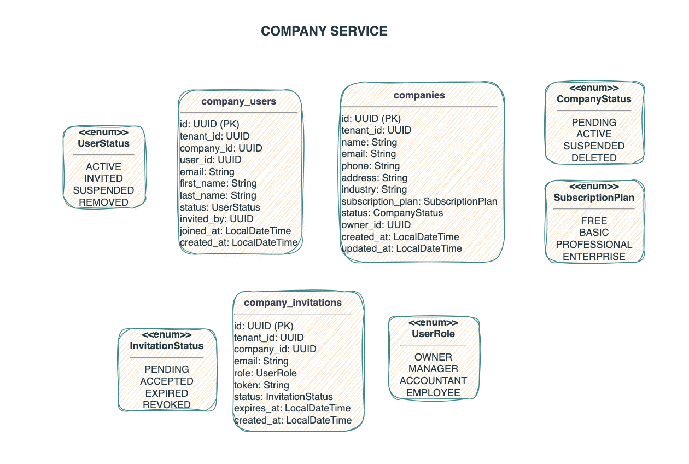
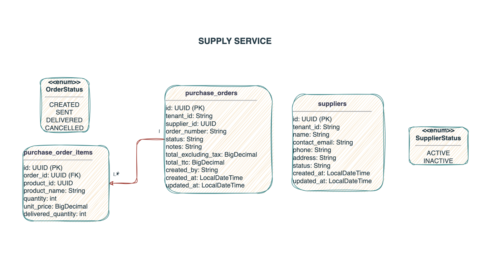
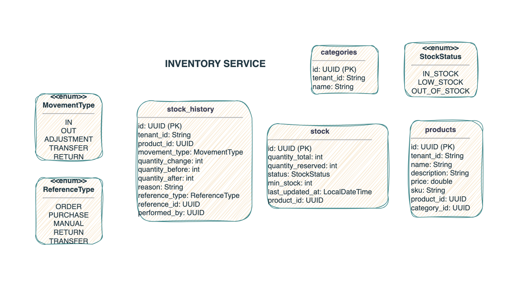
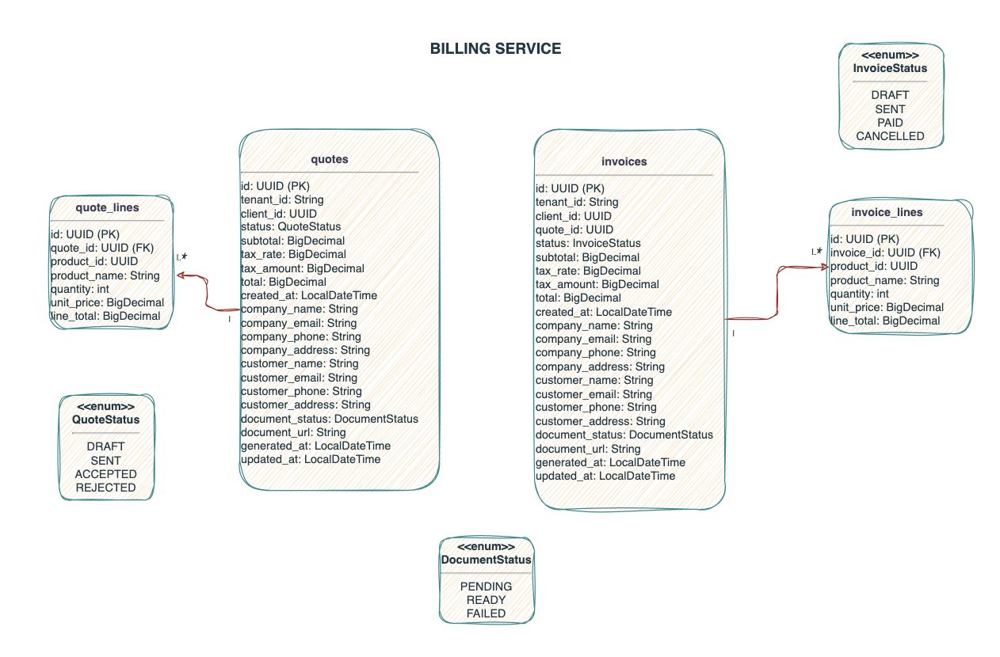
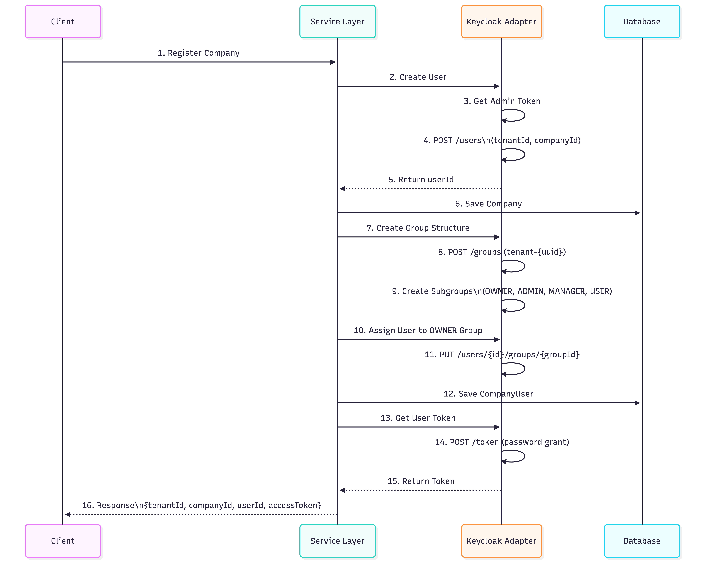

# InvoSmart - Multi-Tenant Business Management System

## Frontend Repository: https://github.com/aliyara290/InovSmart-system-Angular
## Config Server Repository: https://github.com/aliyara290/InovSmart-config-server

## Table of Contents
- [Overview](#overview)
- [The Problem](#the-problem)
- [The Solution](#the-solution)
- [System Architecture](#system-architecture)
- [Services Overview](#services-overview)
- [Database Design](#database-design)
- [Why Hexagonal Architecture](#why-hexagonal-architecture)
- [Why Apache Kafka](#why-apache-kafka)
- [Why Table IDs Instead of JPA Relationships](#why-table-ids-instead-of-jpa-relationships)
- [Keycloak Integration Workflow](#keycloak-integration-workflow)
- [Technology Stack](#technology-stack)

---

## Overview

InvoSmart is an enterprise-grade, **multi-tenant business management system** built using microservices architecture. It provides companies with a comprehensive suite of tools to manage their inventory, suppliers, billing, and invoicing operations in a secure, scalable, and isolated environment.

The system is designed to support multiple companies (tenants) on a single platform while ensuring complete data isolation and security. Each company operates independently with its own users, inventory, suppliers, and financial documents.

---

## The Problem

Modern businesses, especially small to medium-sized enterprises (SMEs), face several challenges:

1. **Fragmented Systems**: Companies often use multiple disconnected tools for inventory management, supplier orders, invoicing, and billing, leading to data inconsistencies and operational inefficiencies.

2. **High Costs**: Purchasing and maintaining separate software licenses for different business functions is expensive and resource-intensive.

3. **Data Silos**: Information scattered across different systems makes it difficult to get a unified view of business operations.

4. **Scalability Issues**: Traditional monolithic applications struggle to scale individual components based on demand.

5. **Multi-Tenancy Requirements**: SaaS providers need to serve multiple customers on a single platform while ensuring complete data isolation and security.

6. **Access Control Complexity**: Managing different user roles (Owner, Manager, Accountant, Employee) with appropriate permissions across various business functions is challenging.

7. **Integration Difficulties**: Connecting different business processes and ensuring real-time data synchronization between modules is complex.

---

## The Solution

InvoSmart addresses these challenges by providing:

- **Unified Platform**: A single, integrated system that handles inventory management, supplier relationships, purchase orders, invoicing, and billing.

- **Multi-Tenant Architecture**: Complete data isolation using tenant-based partitioning, allowing multiple companies to operate independently on the same infrastructure.

- **Microservices Design**: Independently deployable services that can scale based on specific business needs.

- **Role-Based Access Control**: Integration with Keycloak for sophisticated user management with roles (OWNER, MANAGER, ACCOUNTANT, EMPLOYEE).

- **Event-Driven Communication**: Real-time synchronization between services using Apache Kafka, ensuring data consistency across the platform.

- **Subscription-Based Model**: Flexible subscription plans (FREE, BASIC, PROFESSIONAL, ENTERPRISE) to accommodate businesses of different sizes.

- **Document Generation**: Automated generation of professional invoices and quotes in PDF format.

---

## System Architecture

InvoSmart follows a **microservices architecture** with the following components:

### Infrastructure Layer
- **Eureka Server**: Service discovery and registry
- **Config Server**: Centralized configuration management
- **API Gateway**: Single entry point for all client requests, handles routing, authentication, and load balancing

### Business Services Layer
- **Company Service**: Manages companies, users, invitations, and authentication
- **Inventory Service**: Handles products, categories, stock levels, and stock movements
- **Supply Service**: Manages suppliers and purchase orders
- **Billing Service**: Creates and manages quotes and invoices
- **Generator Service**: Generates PDF documents for invoices and quotes

### Supporting Infrastructure
- **Apache Kafka**: Event streaming platform for inter-service communication
- **Keycloak**: Identity and Access Management (IAM) for authentication and authorization
- **PostgreSQL**: Primary database for each service

---

## Services Overview

### 1. Company Service
**Purpose**: Core service managing multi-tenancy, user authentication, and authorization.

**Responsibilities**:
- Company registration and management
- User lifecycle management (invitation, activation, suspension, removal)
- Integration with Keycloak for authentication
- Tenant isolation enforcement
- Subscription plan management
- User role assignment (OWNER, MANAGER, ACCOUNTANT, EMPLOYEE)

**Key Features**:
- Multi-tenant data isolation
- Company invitation system with token-based verification
- Keycloak integration for centralized authentication
- User status tracking (ACTIVE, INVITED, SUSPENDED, REMOVED)

### 2. Inventory Service
**Purpose**: Manages product catalog and stock levels for each company.

**Responsibilities**:
- Product and category management
- Real-time stock tracking
- Stock movement history (IN, OUT, ADJUSTMENT, TRANSFER, RETURN)
- Low stock alerts
- Stock status monitoring (IN_STOCK, LOW_STOCK, OUT_OF_STOCK)

**Key Features**:
- Multi-level stock tracking (total, reserved quantities)
- Comprehensive movement history with reference tracking
- Category-based product organization
- Automatic stock status calculation

### 3. Supply Service
**Purpose**: Handles supplier relationships and purchase order management.

**Responsibilities**:
- Supplier directory management
- Purchase order creation and tracking
- Order status management (CREATED, SENT, DELIVERED, CANCELLED)
- Order item management with delivery tracking

**Key Features**:
- Complete purchase order lifecycle management
- Tax calculation and tracking
- Supplier status management
- Delivered quantity tracking per order item

### 4. Billing Service
**Purpose**: Manages customer quotes and invoices.

**Responsibilities**:
- Quote creation and management
- Invoice generation from quotes or standalone
- Financial calculations (subtotal, tax, total)
- Document status tracking (DRAFT, SENT, PAID, ACCEPTED, REJECTED, CANCELLED)
- Client information management

**Key Features**:
- Quote-to-invoice conversion
- Comprehensive line item management
- Tax rate application
- Document status workflow
- Client and company information embedding

### 5. Generator Service
**Purpose**: Document generation for business documents.

**Responsibilities**:
- PDF generation for invoices and quotes
- Professional document formatting
- Template-based document creation

---

## Database Design

The system uses a **database-per-service** pattern with PostgreSQL. Each service maintains its own database schema for maximum autonomy and isolation.

### Company Service Database


**Tables**:
- **companies**: Core company information with subscription plans
- **company_users**: User profiles linked to companies and Keycloak
- **company_invitations**: Invitation system with tokens and expiration

**Key Design**:
- Tenant isolation via `tenant_id` in all tables
- User status lifecycle management
- Role-based access control integration
- Keycloak user ID mapping

### Supply Service Database


**Tables**:
- **suppliers**: Supplier directory per tenant
- **purchase_orders**: Purchase order headers with totals and tax
- **purchase_order_items**: Line items with product references and delivery tracking

**Key Design**:
- Tenant-based supplier isolation
- Product references via UUID (no foreign keys across services)
- Order status workflow
- Delivered quantity tracking separate from ordered quantity

### Inventory Service Database


**Tables**:
- **products**: Product catalog with pricing and SKU
- **categories**: Product categorization
- **stock**: Current stock levels with reserved quantity tracking
- **stock_history**: Complete audit trail of stock movements

**Key Design**:
- Product-category relationship via IDs
- Stock reservation support
- Movement history with reference tracking (ORDER, PURCHASE, MANUAL, RETURN, TRANSFER)
- Automatic stock status calculation

### Billing Service Database


**Tables**:
- **quotes**: Quote headers with client and company information
- **quote_lines**: Quote line items
- **invoices**: Invoice headers with financial totals
- **invoice_lines**: Invoice line items

**Key Design**:
- Client information denormalization for document immutability
- Product references via UUID
- Document status workflow
- Tax calculation per document

---

## Why Table IDs Instead of JPA Relationships

The decision to use **UUID references instead of JPA relationships** (like @OneToMany, @ManyToOne) is a deliberate architectural choice driven by microservices best practices:

### 1. **Service Autonomy and Boundaries**
Each microservice owns its database and domain. Using foreign key relationships across services would violate the principle of service independence. For example, Inventory Service references products by UUID from Supply Service without creating a database-level dependency.

### 2. **Loose Coupling**
Services communicate through events (Kafka) and APIs, not through shared databases. This allows services to evolve independently without breaking changes affecting other services.

### 3. **Data Duplication is Intentional**
In the Billing Service, client and company information is duplicated in quotes and invoices. This ensures document immutability—even if a client's contact information changes later, historical documents remain accurate.

### 4. **Cross-Service References**
When the Inventory Service needs to track which purchase order caused a stock movement, it stores the `order_id` as a UUID reference without creating a foreign key constraint. This maintains service boundaries while preserving traceability.

### 5. **Scalability and Deployment**
Services can be deployed, scaled, and updated independently. Database relationships would require coordinated deployments and schema migrations across services.

### 6. **Multi-Tenancy**
The tenant_id pattern ensures data isolation. Using UUIDs without foreign keys makes it easier to implement tenant-based partitioning and potential future data migration strategies.

### 7. **Eventual Consistency**
The system embraces eventual consistency. When a product is updated in Inventory Service, related services receive events via Kafka and update their references asynchronously.

---

## Why Hexagonal Architecture

InvoSmart implements **Hexagonal Architecture** (also known as Ports and Adapters) for each microservice:

### Structure
- **Domain**: Business logic and entities (framework-agnostic)
- **Application**: Use cases and orchestration
- **Adapters**: Input adapters (REST controllers, Kafka consumers) and Output adapters (Database repositories, Kafka producers, external API clients)
- **Infrastructure**: Configuration, security, and cross-cutting concerns

### Benefits

**1. Business Logic Protection**
The domain layer contains pure business logic without framework dependencies. This makes the core business rules testable and maintainable.

**2. Technology Independence**
Input adapters can be easily replaced (REST API → gRPC) or output adapters changed (PostgreSQL → MongoDB) without affecting business logic.

**3. Testability**
Domain and application layers can be unit tested without databases or web servers. Adapters can be mocked easily.

**4. Clear Separation of Concerns**
Each layer has a well-defined responsibility:
- Domain: What the business does
- Application: How use cases are orchestrated
- Adapters: How we interact with the outside world

**5. Flexibility**
Multiple adapters can coexist. For example, Company Service has both REST API adapter and Keycloak adapter without mixing concerns.

**6. Maintainability**
Changes in framework versions or external APIs only affect the adapter layer, not business logic.

**7. Onboarding**
New developers can understand business logic by reading the domain layer without understanding Spring Boot or Kafka details.

---

## Why Apache Kafka

Apache Kafka serves as the **event backbone** of InvoSmart, enabling asynchronous, event-driven communication between services:

### Use Cases

**1. Stock Updates**
When a purchase order is delivered (Supply Service), an event is published to Kafka. Inventory Service consumes this event and updates stock levels automatically.

**2. Order Notifications**
When an invoice is created (Billing Service), other services can react—for example, reserving stock or sending notifications.

**3. Audit Logging**
All significant business events are published to Kafka topics, creating a complete audit trail across services.

### Benefits

**1. Asynchronous Communication**
Services don't wait for synchronous responses. Supply Service can confirm a purchase order immediately while Inventory Service updates stock in the background.

**2. Loose Coupling**
Services communicate through events without knowing about each other. New services can subscribe to existing events without modifying producers.

**3. Scalability**
Kafka handles high-throughput event streams. Services can be scaled independently based on their processing capacity.

**4. Reliability**
Kafka provides message persistence and replay capabilities. If a service goes down, it can catch up on missed events when it restarts.

**5. Event Sourcing Potential**
The system can reconstruct state by replaying events, useful for debugging and analytics.

**6. Real-Time Processing**
Changes propagate across services in near real-time, ensuring data consistency without tight coupling.

**7. Decoupled Deployment**
Services can be deployed independently. Kafka acts as a buffer, allowing services to process events at their own pace.

---

## Keycloak Integration Workflow

InvoSmart uses **Keycloak** as its Identity and Access Management (IAM) solution, providing enterprise-grade authentication and authorization.

### Company Registration and User Setup Flow



The diagram above illustrates the complete workflow when a new company registers:

**1. Company Registration**
Client initiates company registration through the API Gateway.

**2-5. User Creation in Keycloak**
- Service Layer calls Keycloak Adapter to create the owner user
- Adapter obtains an admin token from Keycloak
- Creates the user in Keycloak using admin API
- Returns the Keycloak user ID

**6. Company Persistence**
Company information is saved in the database.

**7-9. Tenant Group Structure**
- Creates a tenant-specific group in Keycloak (named after tenant UUID)
- Creates four subgroups: OWNER, MANAGER, ACCOUNTANT, EMPLOYEE
- This structure enables role-based access control

**10-11. Owner Assignment**
- Assigns the newly created user to the OWNER group
- This grants the user owner-level permissions

**12. User Mapping**
Saves the company user record linking the Keycloak user ID to the company.

**13-15. Token Generation**
- Obtains a user token from Keycloak using password grant
- This token will be used for subsequent authenticated requests

**16. Response**
Returns tenant ID, company ID, user ID, and access token to the client.

### Why Keycloak?

**1. Multi-Tenancy Support**
Keycloak's group structure perfectly supports tenant isolation. Each company has its own group hierarchy.

**2. Role-Based Access Control**
Subgroups (OWNER, MANAGER, ACCOUNTANT, EMPLOYEE) map directly to business roles with different permission levels.

**3. Token-Based Security**
JWT tokens contain tenant and role information, enabling stateless authentication across microservices.

**4. Single Sign-On (SSO)**
Users can access multiple services with a single authentication.

**5. Centralized User Management**
All user authentication and authorization logic is delegated to Keycloak, removing this complexity from business services.

**6. Industry Standard**
Keycloak implements OAuth 2.0 and OpenID Connect protocols, ensuring compatibility with standard security practices.

**7. User Lifecycle Management**
Keycloak handles password resets, account locking, and session management automatically.

---

## Technology Stack

### Backend
- **Java 17**: Modern Java features and performance
- **Spring Boot 3.x**: Application framework
- **Spring Cloud**: Microservices infrastructure (Gateway, Config, Discovery)
- **Spring Data JPA**: Data persistence
- **Spring Security**: Security framework
- **Spring Kafka**: Kafka integration

### Infrastructure
- **Apache Kafka**: Event streaming platform
- **PostgreSQL**: Relational database
- **Keycloak**: Identity and Access Management
- **Netflix Eureka**: Service discovery
- **Spring Cloud Config**: Configuration management
- **Spring Cloud Gateway**: API Gateway

### Architecture Patterns
- **Microservices Architecture**: Service decomposition by business capability
- **Hexagonal Architecture**: Clean separation of business logic
- **Event-Driven Architecture**: Asynchronous communication via Kafka
- **Database per Service**: Data autonomy and isolation
- **API Gateway Pattern**: Single entry point with routing
- **Service Registry Pattern**: Dynamic service discovery

### Development & Operations
- **Maven**: Dependency management and build
- **Docker**: Containerization (docker-compose for local development)
- **Git**: Version control

---

## Project Structure

```
InvoSmart/
├── docs/                          # Architecture diagrams and documentation
├── infrastructure/
│   ├── api-gateway/              # Spring Cloud Gateway
│   ├── config-server/            # Spring Cloud Config Server
│   └── eureka-server/            # Netflix Eureka Service Discovery
├── services/
│   ├── company-service/          # Multi-tenancy and user management
│   ├── inventory-service/        # Product and stock management
│   ├── supply-service/           # Supplier and purchase orders
│   ├── billing-service/          # Quotes and invoices
│   └── generator-service/        # PDF document generation
└── docker/                        # Docker compose configurations
```

Each service follows the hexagonal architecture structure:
```
service-name/
└── src/main/java/com/aliyara/servicename/
    ├── adapters/                 # Input/Output adapters
    ├── application/              # Use cases and services
    ├── domain/                   # Business entities and logic
    ├── infrastructure/           # Configuration and infrastructure
    └── interfaces/               # DTOs and contracts
```

---

## Conclusion

InvoSmart represents a modern approach to building enterprise business management systems. By leveraging microservices architecture, hexagonal design principles, event-driven communication, and enterprise-grade security, it provides a scalable, maintainable, and feature-rich platform for multi-tenant business operations.

The architectural decisions—from using table IDs instead of JPA relationships to choosing Kafka for inter-service communication—are all driven by the principles of **service autonomy**, **loose coupling**, **scalability**, and **maintainability**. This ensures the system can evolve and grow with changing business requirements while maintaining reliability and performance.
